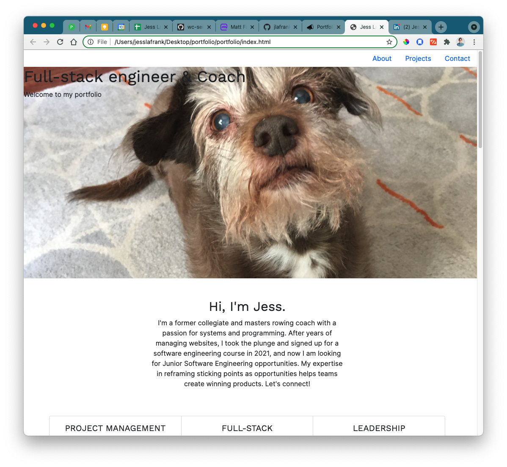
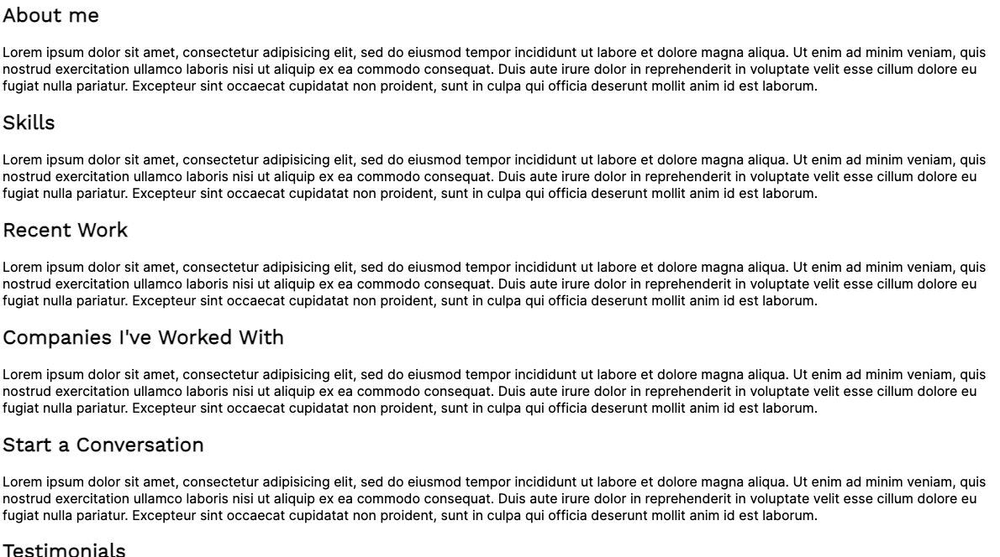
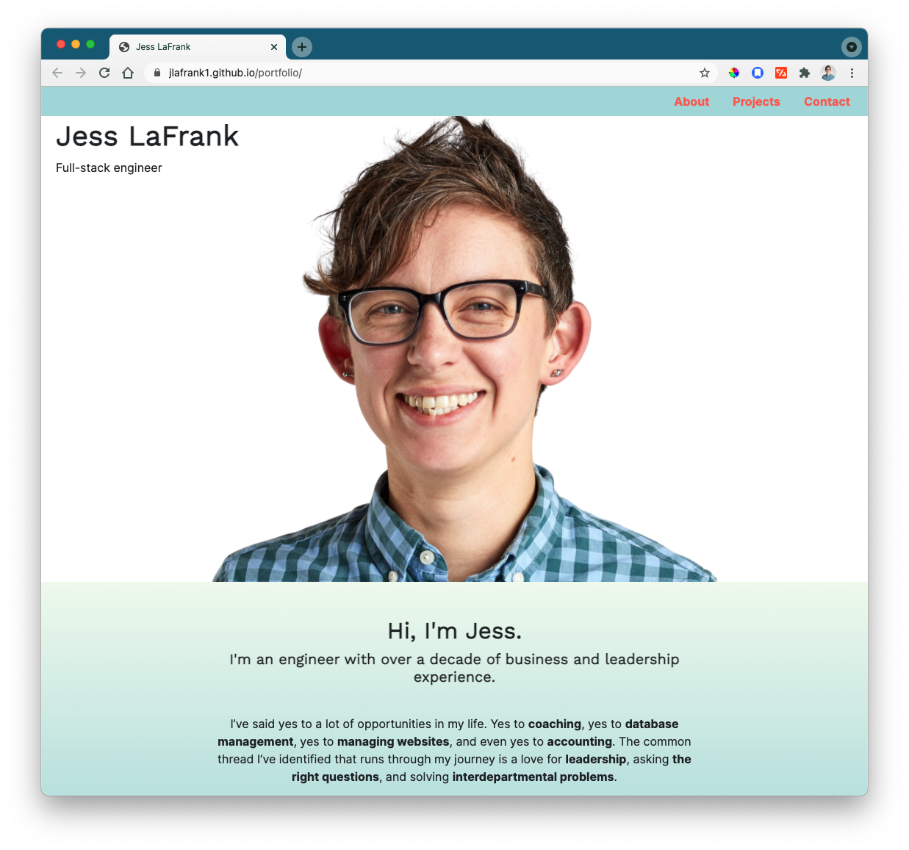

<!-- ABOUT THE PROJECT -->

## About The Project

This is where my Portfolio lives.

## Overview & User Stories

- All users can generate random things to do when bored

### How it started:

### How it's going:

(<a href="#top">back to top</a>)

### Built With

This is an HTML/CSS/JavaScript page. I plan to refactor this with React, and potentially add a back-end technology such as Express.

- HTML
- CSS
- JS
- Bootstrap

(<a href="#top">back to top</a>)

<!-- ROADMAP -->

## Roadmap

- [] Optimize for mobile
- [] Refactor as a MERN application

(<a href="#top">back to top</a>)

<!-- CONTACT -->

## Contact

Please strike up a conversation with me, especially if you're interested in rollerskates!

- [LinkedIn](https://www.linkedin.com/in/jesslafrank/)
- [GitHub](https://github.com/jlafrank1)
- [Instagram](https://www.instagram.com/blood.sweat.and.ears/)

(<a href="#top">back to top</a>)

<!-- ACKNOWLEDGMENTS -->

## Acknowledgments

The following resources helped me immensely when creating this project:

- [coolers.co](https://coolors.co/)
- [Canva](https://www.canva.com/)

(<a href="#top">back to top</a>)

